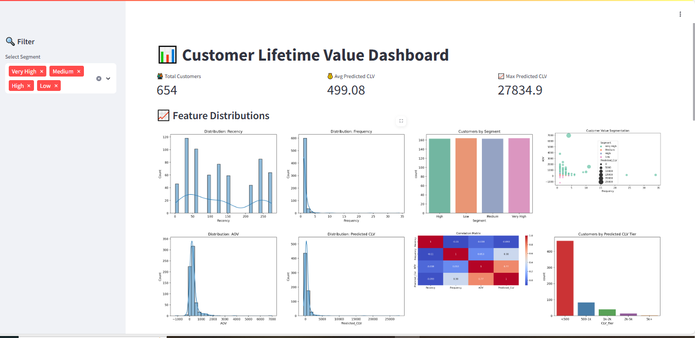
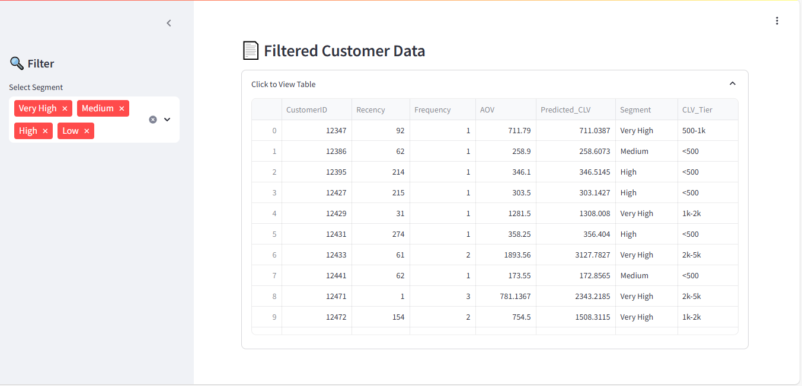

# CLV


This project predicts the **Customer Lifetime Value (CLV)** using transactional data and visualizes key customer behavior patterns via an interactive Streamlit dashboard.

---
# 📈 Customer Lifetime Value (CLV) Prediction Dashboard

## 🧠 Objective

To help businesses segment customers and prioritize marketing strategies by predicting the future value each customer will bring based on historical purchase behavior.

---

## 🔧 Tools Used

- **Python** (Pandas, NumPy, Seaborn, Matplotlib, Scikit-learn, XGBoost)
- **Streamlit** for dashboard development
- **Jupyter Notebook** for data preprocessing & model building

---

## 📦 Project Structure

```
customer_ltv_dashboard/
├── model.pkl                  # Trained XGBoost model
├── predicted_clv.csv          # Final dataset with predicted CLV and segments
├── streamlit_app.py           # Dashboard source code
├── transactions.csv           # Raw transactional data
├── requirements.txt           # Python dependencies
└── README.md                  # Project documentation
```

---

## 📊 Features and Visualizations

The dashboard includes the following components:

### ✅ Summary Metrics
- Total Customers
- Average Predicted CLV
- Maximum Predicted CLV

### 📈 Visualizations
- Histograms: Recency, Frequency, AOV, Predicted CLV
- Bar Chart: Customer Segments
- Boxplot: CLV by Segment
- Time Series: CLV trend over time by segment
- Heatmap: Feature correlations
- Scatterplot: Frequency vs AOV (CLV bubble)
- Bar Chart: Customers by CLV tier
- Bar Chart: Avg CLV by Frequency Bucket

### 📄 Data Table
- View filtered customer data

---

## 📂 Data Preprocessing

1. Load raw transactions:
   - Columns: `CustomerID`, `InvoiceDate`, `Quantity`, `UnitPrice`, etc.

2. Compute:
   - `TotalAmount = Quantity × UnitPrice`

3. Feature Engineering:
   - **Recency**: Days since last purchase
   - **Frequency**: Number of transactions
   - **AOV**: Average Order Value
   - **Last Purchase Date**: Used for time series

4. Merge all features:
   - Final dataset used for model training and visualization

---

## 🧠 Model Training

- **Model**: XGBoost Regressor
- **Features**: Recency, Frequency, AOV
- **Target**: Total purchase value per customer (proxy for CLV)
- **Evaluation**: MAE, RMSE

---

## 🔍 Customer Segmentation

Based on predicted CLV:
- **Low**
- **Medium**
- **High**
- **Very High**

Used for marketing strategy prioritization.

---

## 🚀 Streamlit Dashboard

To launch the dashboard:

```bash
pip install -r requirements.txt
streamlit run streamlit_app.py
```
### 📊 Sample Dashboard Screenshots




---

## 📁 Requirements

```txt
streamlit
pandas
numpy
scikit-learn
xgboost
seaborn
matplotlib
joblib
```

---

## 📌 Future Improvements

- SHAP value explanation for model interpretation
- CSV export & report generator
- Upload CSV to run predictions live
- Cloud deployment (Streamlit Cloud, Heroku)

---

## 🏁 Conclusion

This project provides a complete machine learning pipeline — from data cleaning and feature engineering to model prediction and an interactive dashboard — for identifying high-value customers and optimizing marketing focus.
